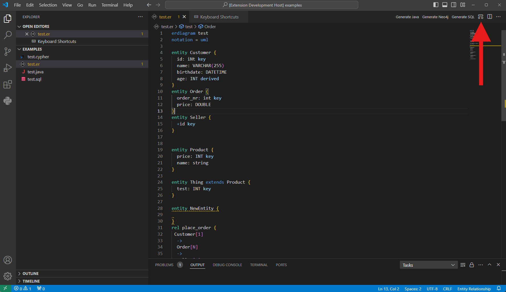

# bigER-langium

[Langium](https://langium.org/)-based realization of [bigER](https://github.com/borkdominik/bigER).

For information for developers see the [Developer Guide](./DeveloperGuide.md)

## Getting Started

Requirements:
- [Node.js](https://nodejs.org/en/) 20.10 or above
- [VS Code](https://code.visualstudio.com/) 1.67 or above
- [yarn](https://classic.yarnpkg.com/lang/en/docs/install/)


Clone the repository and in the root directory of the project, run the command:

```bash
yarn
```

The command automatically installs all dependencies and builds the modules located in `packages/`.
To run the extension in VS Code, press <kbd>F5</kbd> or select `Run ➜ Start Debugging` from the menu.

## How To Use

#### Creating a new file

To create a new file, make sure you have the extension installed. Then create a new file with the `.er` filename extension. At the top of the file declare the name of the model and the notation syntax. For instance:
```
erdiagram test
notation = uml
```

Below you can start writing your own ER-model.

To open the diagram view, click on the "open diagram" on the top right of the editor window. 

#### Creating new Entities (and Attributes)

Entities are the base building block in BigER. Entities always have a name and may have attributes. To start an entity use the `entity` keyword, after that you may name the entity. Please note that entity names are unique. Having multiple entities with the same name will lead to validation errors. An entity may also inherit from another entity by using `extends [entity name]`.

Inside of an entity attributes can be declared. Attributes have an optional visibility modifier (public/private). Attribute names are also unique but only among an entity and its inheritors. An attribute can also have a datatype and an additional annotation. The additional annotation is used to signal that an attribute is a key, optional or has another modifier.

Below is an example of a valid entity:

```er
entity Customer {
  id: int key
  name: VARCHAR(255)
  birthdate: DATETIME
  age: INT derived
}
```

#### Creating new relationships

<ol>
<li> Ensure you have two or more entities </li>
<li> Declare a new relationship using the "relationship" keyword followed by a name for the relationship </li>
<li> Define the content of the relationship inside curly brackets. At a minimum, the involved entities, tpye and cardinality must be defined.
<ol>
<li> The involved entities are defined by referencing two existing entities </li>
<li> The relationship type is defined by connecting the entities with a relation symbol. This symbol can be either "->" for a binary relationship, "-o"/"o-" for an aggregation on the side of the "o" or "-*"/"*-" for a composition on the side of the "*" </li>
<li> The cardinality is defined in square brackets immediately following each entity. The supported cardinalities are [1], [0..1], [0..N] and [N] (the quantities "0", "1" and "N" connected by two dots). </li>
</ol>
</li>
</ol>

Optionally, the following features are available:
- Roles: for each entity, the role it takes in the relationship can be defined inside the curly brackets by inserting a vertical line followed by a string after the quantity
- Attributes: after the required content, any number of attributes may be defined. See the tutorial on attributes for further details
- Weak relationships: weak relationships between an entity and a weak entity can be defined as such using the "weak" keyword before declaring the relationship
- Ternary relationships: a relationship involving three entities can be defined by extending a binary relationship with an additional relationship type followed by an additional entity.

Note: Ternary Relationships do not support Aggregation or Composition, which may lead to unexpected behaviour. For cases where this is needed, use a series of binary relationships instead.

### Comments

To write a one-line comment, use "//" before your text
For multi-line comments use "/\*" to start and "\*/" to terminate

## Export Type Mapping Settings

bigER can generate SQL and MongoDB exports from an ER model. By default, the exporter maps ER datatypes to the selected target's built-in datatype defaults. You can override those mappings in VS Code with the `biger.export.typeMappings` setting.

The setting supports two levels of override:

| Override level | Setting key | Description |
| --- | --- | --- |
| Exact datatype | `types` | Maps the literal datatype written in the ER file, such as `int` or `double`. |
| Type family | `typeFamilies` | Maps bigER exporter datatype families, such as `integer`, `float`, `decimal`, `string`, `date`, `boolean`, or `binary`. |

Exact datatype overrides are applied before type family overrides. If no override is configured, or if an override is invalid, the exporter keeps the built-in default mapping.

The examples below use this ER model:

```er
erdiagram MappingDemo

entity A {
    id: INT key
    score: DOUBLE
    price: DECIMAL
    name: VARCHAR
    active: BOOLEAN
    photo: BLOB
}
```

### Example 1: Default Export Behavior

With no VS Code setting configured, the exporter uses its built-in mappings.

VS Code setting:

```json
{}
```

PostgreSQL output:

```sql
CREATE TABLE A(
    id INT,
    score DOUBLE PRECISION NOT NULL,
    price DECIMAL NOT NULL,
    name VARCHAR NOT NULL,
    active BOOLEAN NOT NULL,
    photo BYTEA NOT NULL,
    PRIMARY KEY (id)
);
```

MySQL output:

```sql
CREATE TABLE A(
    id INT,
    score DOUBLE NOT NULL,
    price DECIMAL NOT NULL,
    name VARCHAR NOT NULL,
    active BOOLEAN NOT NULL,
    photo BLOB NOT NULL,
    PRIMARY KEY (id)
);
```

MongoDB output:

```js
await db.createCollection("A", {
  validator: {
    $jsonSchema: {
      bsonType: "object",
      required: ["_id", "score", "price", "name", "active", "photo"],
      properties: {
        _id: {
          bsonType: "int"
        },
        score: {
          bsonType: "double"
        },
        price: {
          bsonType: "decimal"
        },
        name: {
          bsonType: "string"
        },
        active: {
          bsonType: "bool"
        },
        photo: {
          bsonType: "binData"
        }
      }
    }
  },
  validationLevel: "strict",
  validationAction: "error"
});
```

### Example 2: SQL Exact Datatype Overrides

Use `types` to override only the literal datatypes named in the setting. This example changes PostgreSQL `INT` to `BIGINT` and `DOUBLE` to `REAL`.

VS Code setting:

```json
{
  "biger.export.typeMappings": {
    "sql": {
      "postgres": {
        "types": {
          "int": "BIGINT",
          "double": "REAL"
        }
      }
    }
  }
}
```

PostgreSQL output:

```sql
CREATE TABLE A(
    id BIGINT,
    score REAL NOT NULL,
    price DECIMAL NOT NULL,
    name VARCHAR NOT NULL,
    active BOOLEAN NOT NULL,
    photo BYTEA NOT NULL,
    PRIMARY KEY (id)
);
```

### Example 3: SQL Type Family Overrides

Use `typeFamilies` to override bigER exporter datatype groups. This example changes all integer-like datatypes to `BIGINT`, decimal-like datatypes to `NUMERIC(38, 8)`, string-like datatypes to `TEXT`, and boolean-like datatypes to `BOOL` for PostgreSQL export.

VS Code setting:

```json
{
  "biger.export.typeMappings": {
    "sql": {
      "postgres": {
        "typeFamilies": {
          "integer": "BIGINT",
          "float": "DOUBLE PRECISION",
          "decimal": "NUMERIC(38, 8)",
          "string": "TEXT",
          "boolean": "BOOL",
          "binary": "BYTEA"
        }
      }
    }
  }
}
```

PostgreSQL output:

```sql
CREATE TABLE A(
    id BIGINT,
    score DOUBLE PRECISION NOT NULL,
    price NUMERIC(38, 8) NOT NULL,
    name TEXT NOT NULL,
    active BOOL NOT NULL,
    photo BYTEA NOT NULL,
    PRIMARY KEY (id)
);
```

### Example 4: Per-Dialect SQL Overrides

SQL mappings are scoped to the selected dialect. A PostgreSQL override does not affect MySQL export, and a MySQL override does not affect PostgreSQL export.

VS Code setting:

```json
{
  "biger.export.typeMappings": {
    "sql": {
      "postgres": {
        "types": {
          "int": "BIGINT"
        }
      },
      "mysql": {
        "types": {
          "boolean": "TINYINT(1)"
        }
      }
    }
  }
}
```

PostgreSQL output:

```sql
CREATE TABLE A(
    id BIGINT,
    score DOUBLE PRECISION NOT NULL,
    price DECIMAL NOT NULL,
    name VARCHAR NOT NULL,
    active BOOLEAN NOT NULL,
    photo BYTEA NOT NULL,
    PRIMARY KEY (id)
);
```

MySQL output:

```sql
CREATE TABLE A(
    id INT,
    score DOUBLE NOT NULL,
    price DECIMAL NOT NULL,
    name VARCHAR NOT NULL,
    active TINYINT(1) NOT NULL,
    photo BLOB NOT NULL,
    PRIMARY KEY (id)
);
```

### Example 5: MongoDB BSON Overrides

MongoDB export uses JSON schema `bsonType` values. MongoDB mappings also support exact datatype overrides and type family overrides. Exact `types` mappings take precedence over `typeFamilies`.

VS Code setting:

```json
{
  "biger.export.typeMappings": {
    "mongo": {
      "typeFamilies": {
        "integer": "long",
        "float": "decimal"
      },
      "types": {
        "decimal": "double"
      }
    }
  }
}
```

MongoDB output:

```js
await db.createCollection("A", {
  validator: {
    $jsonSchema: {
      bsonType: "object",
      required: ["_id", "score", "price", "name", "active", "photo"],
      properties: {
        _id: {
          bsonType: "long"
        },
        score: {
          bsonType: "decimal"
        },
        price: {
          bsonType: "double"
        },
        name: {
          bsonType: "string"
        },
        active: {
          bsonType: "bool"
        },
        photo: {
          bsonType: "binData"
        }
      }
    }
  },
  validationLevel: "strict",
  validationAction: "error"
});
```

### Example 6: Invalid Override Fallback

Invalid mapping values are ignored. The exporter should still run and should fall back to the built-in mapping for invalid or empty entries.

VS Code setting:

```json
{
  "biger.export.typeMappings": {
    "sql": {
      "postgres": {
        "types": {
          "int": 42,
          "double": "   "
        },
        "typeFamilies": {
          "decimal": [],
          "string": ""
        }
      }
    },
    "mongo": {
      "types": {
        "int": "not-a-bson-type"
      },
      "typeFamilies": {
        "float": "not-a-bson-type"
      }
    }
  }
}
```

PostgreSQL output:

```sql
CREATE TABLE A(
    id INT,
    score DOUBLE PRECISION NOT NULL,
    price DECIMAL NOT NULL,
    name VARCHAR NOT NULL,
    active BOOLEAN NOT NULL,
    photo BYTEA NOT NULL,
    PRIMARY KEY (id)
);
```

MongoDB output:

```js
await db.createCollection("A", {
  validator: {
    $jsonSchema: {
      bsonType: "object",
      required: ["_id", "score", "price", "name", "active", "photo"],
      properties: {
        _id: {
          bsonType: "int"
        },
        score: {
          bsonType: "double"
        },
        price: {
          bsonType: "decimal"
        },
        name: {
          bsonType: "string"
        },
        active: {
          bsonType: "bool"
        },
        photo: {
          bsonType: "binData"
        }
      }
    }
  },
  validationLevel: "strict",
  validationAction: "error"
});
```
